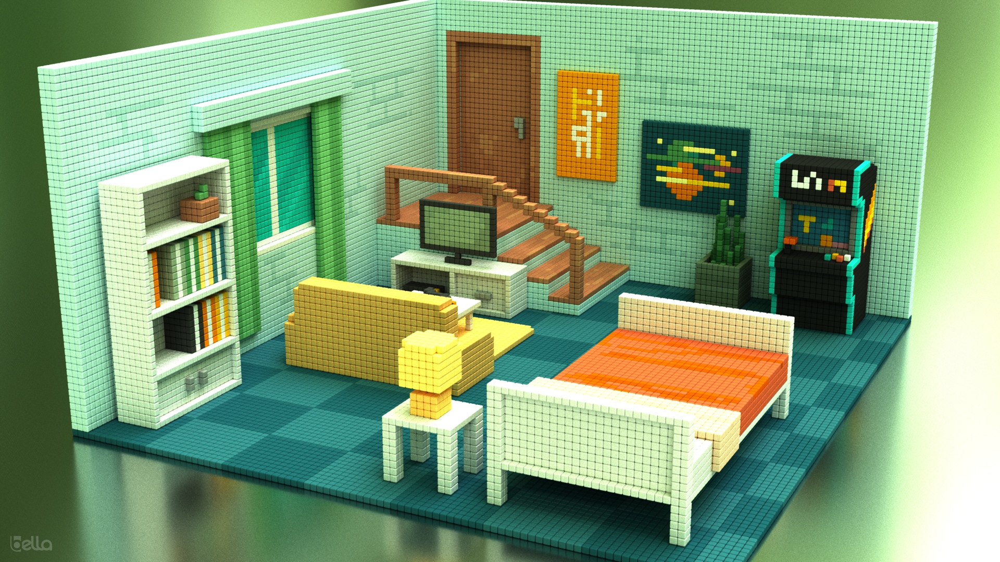

# vmax2bella
[WORK IN PROGRESS, file format is currently not fully grokked]

Command line convertor from [VoxelMax](https://voxelmax.com) .vmax to DiffuseLogic .bsz




# Build

Download SDK for your OS and move **bella_scene_sdk** into your **workdir**. On Windows rename unzipped folder by removing version ie bella_engine_sdk-24.6.0 -> bella_scene_sdk
https://bellarender.com/builds/


```
workdir/
├── bella_scene_sdk/
├── libplist/
├── lzfse/
├── opengametools/
└── vmax2bella/
```

# MacOS

```
mkdir workdir
git clone https://github.com/lzfse/lzfse
mkdir -p lzfse/build
cd lzfse/build
/Applications/CMake.app/Contents/bin/cmake -DCMAKE_OSX_ARCHITECTURES="x86_64;arm64" ..
make -j4
cd ../..
mkdir homebrew
curl -L https://github.com/Homebrew/brew/tarball/master | tar xz --strip-components 1 -C homebrew
eval "$(homebrew/bin/brew shellenv)"
brew update --force --quiet
brew install libtool autoconf automake
git clone https://github.com/libimobiledevice/libplist
cd libplist
./autogen.sh --prefix=$PWD/install --without-cython
make -j4
install_name_tool -id @rpath/libplist-2.0.4.dylib src/.libs/libplist-2.0.4.dylib
cd ..
git clone https://github.com/jpaver/opengametools.git
git clone https://github.com/oomer/vmax2bella.git
cd vmax2bella
make
```

# Linux [NOT READY]

```
mkdir workdir
git clone https://github.com/lzfse/lzfse
mkdir lzfse/build
cd lzfse/build
cmake ..
make -j4
cd ../..
git clone https://github.com/libimobiledevice/libplist
cd libplist
./autogen.sh --prefix=$PWD/install --without-cython
make -j4
cd ..
git clone https://github.com/jpaver/opengametools.git
git clone https://github.com/oomer/vmax2bella.git
cd vmax2bella
make
```

# Windows [NOT READY]
- Install Visual Studio Community 2022
- Add Desktop development with C++ workload
- Launch x64 Native tools Command Prompt for VS2022
```
mkdir workdir
git clone https://github.com/lzfse/lzfse
mkdir -p lzfse/build
cd lzfse/build
cmake ..
msbuild lzfse.vcxproj /p:Configuration=release /p:Platform=x64 /p:PlatformToolset=v143
cd ../..
git clone https://github.com/libimobiledevice/libplist
git clone https://github.com/jpaver/opengametools.git
git clone https://github.com/oomer/vmax2bella.git
cp vmax2bella/patch_libplist/libplist.vcxproj ../libplist
cp vmax2bella/patch_libplist/cnary.c ../libplist/libcnary/cnary.c
cp vmax2bella/patch_libplist/plist.c ../libplist/libcnary/plist.c
cd libplist
msbuild libplist.vcxproj /p:Configuration=release /p:Platform=x64 /p:PlatformToolset=v143
cd ..
cd vmax2bella
msbuild vmax2bella.vcxproj /p:Configuration=release /p:Platform=x64 /p:PlatformToolset=v143
```
